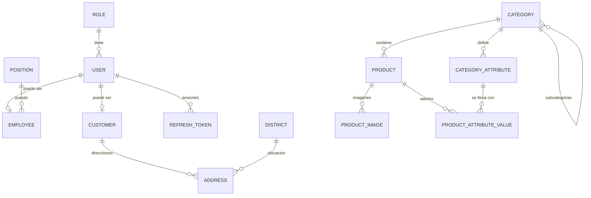

# 🛠️ E-commerce Fullstack

**Plataforma e-commerce para una ferretería: API REST con autenticación completa, roles, catálogo jerárquico y atributos dinámicos por categoría.**

`🚧 En desarrollo activo` · API funcional · Frontend próximamente

---

## 🎯 Sobre el proyecto

Proyecto de portafolio diseñado y construido desde cero. No es un CRUD básico: modela un negocio real (ferretería) con empleados, clientes, catálogo jerárquico, atributos que cambian según la categoría y ubicaciones de Perú, y lo hace con decisiones de seguridad y arquitectura que se pueden revisar en el código.

> El frontend aún no existe. Este repositorio muestra el avance real de la API, que sigue creciendo.

## 📊 En números

|                                                                         |                                     |
| ----------------------------------------------------------------------- | ----------------------------------- |
| **30+** endpoints REST                                                  | **13** migraciones de base de datos |
| **3** roles con control de acceso                                       | **15** modelos relacionales         |
| **11** categorías principales con subcategorías y atributos precargados | **TypeScript** en modo `strict`     |

## ✨ Lo que incluye

### 🔐 Autenticación y seguridad

- Registro y login con email/contraseña (**bcrypt**) y login con **Google OAuth 2.0**.
- **JWT** en cookies `httpOnly` (access de 30 min y refresh de 7 días), no en `localStorage`, lo que reduce el riesgo de robo de token por XSS.
- Los **refresh tokens se guardan hasheados** en la base de datos: si la tabla se filtra, los tokens no sirven.
- Al renovar sesión se emiten nuevos access y refresh token.
- **Login con Google seguro:** solo se vincula a una cuenta existente por correo si Google confirma que el correo está verificado.
- Control de acceso por roles: `admin`, `employee`, `customer`.
- **Sesión sensible al estado del empleado:** en cada request de un empleado se verifica que siga activo y no esté despedido. Si lo despiden, pierde acceso aunque su token no haya expirado.

### 👥 Gestión de empleados

- Alta, edición, baja, activación/desactivación, **despido y recontratación**.
- Al despedir, se desactiva al empleado y se **eliminan todas sus sesiones** en una sola **transacción** (todo o nada).
- Alta de empleado con usuario y datos laborales en una **transacción atómica**.
- Búsqueda por DNI, filtros y **paginación** con metadatos.

### 🗂️ Catálogo

- **Categorías en árbol** (padre/hijo, sin profundidad fija), con breadcrumb y endpoint de árbol completo.
- **Atributos dinámicos por categoría** (`TEXT`, `NUMBER`, `BOOLEAN`, `SELECT`): un taladro tiene voltaje y potencia, una pintura tiene color y acabado, sin tablas distintas por tipo de producto.
- Integridad en base de datos: nombre único dentro del mismo padre y `onDelete: Restrict` para no dejar categorías huérfanas.
- Productos con **SKU autogenerado** (prefijo de la categoría + código aleatorio) y precios en `Decimal`, no en `float`.

### 🌎 Datos de Perú

- Departamentos, provincias y distritos con **código de ubigeo**, cargados por seed, listos para direcciones de entrega.

### 🧱 Calidad del código

- **Arquitectura por módulos:** `routes → controller → service → schema`.
- **Validación con Zod 4** en cada entrada.
- **Manejo centralizado de errores**: traduce errores de Zod, de Prisma (`P2002`, `P2025`, `P2003`) y de JSON mal formado a respuestas HTTP claras y consistentes.
- Clase de errores propia (`AppError`) y formato de respuesta uniforme.
- `tsconfig` estricto (`strict`, `noUncheckedIndexedAccess`, `exactOptionalPropertyTypes`).
- ESM nativo, **Prisma 7** con driver adapter para PostgreSQL y **Express 5**.

## 🗺️ Modelo de datos

## 🧰 Stack

| Capa                | Tecnología                                     |
| ------------------- | ---------------------------------------------- |
| Runtime y framework | Node.js, Express 5                             |
| Lenguaje            | TypeScript (ESM, strict)                       |
| Base de datos       | PostgreSQL, Prisma 7 (`@prisma/adapter-pg`)    |
| Validación          | Zod 4                                          |
| Autenticación       | JWT, bcryptjs, Google OAuth 2.0 (`googleapis`) |
| Gestor de paquetes  | pnpm                                           |

## 📚 Documentación

Guía de instalación, variables de entorno y lista completa de endpoints: **[`backend/README.md`](./backend/README.md)**

## 🧭 Roadmap

- [x] Autenticación (local + Google) y roles
- [x] Gestión de empleados
- [x] Categorías jerárquicas y atributos dinámicos
- [~] Productos (crear y listar; faltan edición, eliminación y filtros)
- [ ] Imágenes de producto y valores de atributos por producto
- [ ] Clientes y direcciones
- [ ] Carrito y pedidos
- [ ] Tests automatizados
- [ ] Frontend en React + Tailwind
- [ ] Despliegue

## 👤 Autor

**Elias Paredes Torres** · Desarrollador web full stack

📫 [LinkedIn](www.linkedin.com/in/eliaspredestorres) · 💻 [GitHub](https://github.com/antonioReynaldo)
